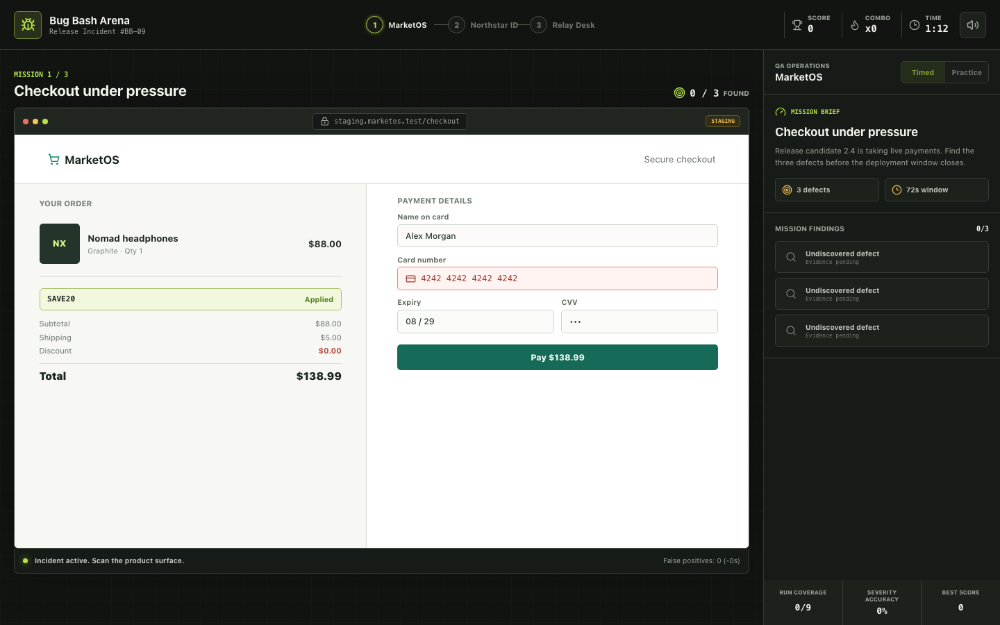

# Bug Bash Arena

[](https://github.com/madara66613/bug-bash-arena/actions/workflows/ci.yml)
[](https://github.com/madara66613/bug-bash-arena/actions/workflows/deploy-pages.yml)

**Bug Bash Arena** is a browser game where the player investigates realistic
product screens, finds hidden defects, and assigns release severity before the
incident timer expires.

**[Play the live game](https://madara66613.github.io/bug-bash-arena/)**



## Why This Project

The project turns practical QA work into a small, replayable game. It
demonstrates frontend engineering and testing skills in one product:

- three original incident missions covering checkout, authentication, and support;
- nine defects with evidence, expected behavior, and P0-P3 severity;
- timed and practice modes with scoring, combo bonuses, and false-positive penalties;
- persistent best score using `localStorage`;
- downloadable Markdown run report for every completed session;
- responsive keyboard-accessible interface with lightweight Web Audio feedback;
- automated unit and UI tests plus GitHub Pages deployment.

## Tech Stack

- React 19 and TypeScript
- Vite
- Vitest and Testing Library
- Lucide icons
- Oxlint
- GitHub Actions and GitHub Pages

## Run Locally

```bash
git clone https://github.com/madara66613/bug-bash-arena.git
cd bug-bash-arena
npm install
npm run dev
```

Open the URL printed by Vite, select a mode, and investigate the highlighted
product surface. A correct severity assignment earns more points and increases
the combo multiplier.

## Quality Checks

```bash
npm run check
```

This runs linting, TypeScript validation, the test suite, and the production
build. The same checks run in CI for pushes and pull requests.

## Project Structure

```text
src/
  App.tsx          Game state and interactive interface
  missions.ts      Mission, defect, and evidence definitions
  game.ts          Scoring, grading, clock, and report logic
  *.test.ts(x)     Unit and UI coverage
docs/
  test-plan.md     Risk-based manual test strategy
```

## Portfolio Notes

This project is intentionally built as a complete small product rather than a
single visual demo. The domain model, deterministic scoring functions,
accessible controls, tests, CI workflow, deployment pipeline, and product
documentation are all part of the repository.

## License

[MIT](LICENSE)
