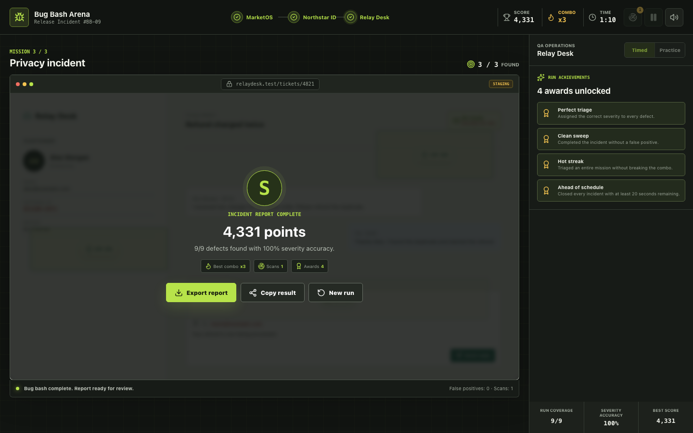
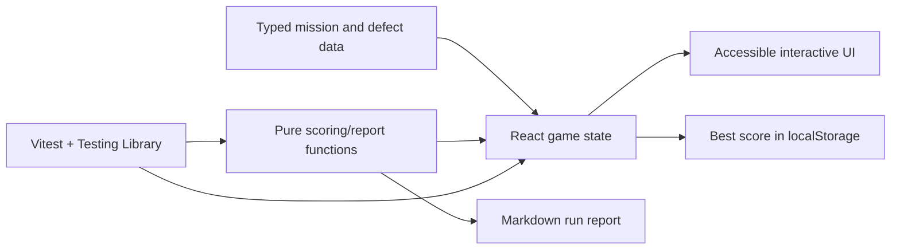

# Bug Bash Arena

A deployed browser game that turns QA investigation and severity triage into a timed, replayable experience.

[](https://github.com/madara66613/bug-bash-arena/actions/workflows/ci.yml)
[](https://github.com/madara66613/bug-bash-arena/actions/workflows/deploy-pages.yml)

**[Play Bug Bash Arena](https://madara66613.github.io/bug-bash-arena/)**


> MarketOS, Northstar ID, Relay Desk, their incidents, and all displayed customer data are fictional scenarios created for this portfolio project.

## Problem

Static QA examples show test cases but rarely demonstrate observation, false-positive control, prioritization, and severity decisions under pressure. Bug Bash Arena packages those skills into an interactive frontend product while keeping scoring and report generation deterministic and testable.

## Playable Features

- Three original incident missions: checkout, authentication, and customer support.
- Nine discoverable defects with actual behavior, expected behavior, evidence, and P0-P3 severity.
- Timed and practice modes.
- Severity scoring, combo bonuses, false-positive penalties, and mission bonuses.
- Limited signal scanner, pausable incidents, and persistent best score.
- Finding review that compares the player's decision with the expected severity.
- Five performance achievements and shareable final results.
- Downloadable Markdown run report with findings, accuracy, bonuses, and coverage.
- Keyboard-accessible controls, responsive layouts, and lightweight Web Audio feedback.
- GitHub Pages deployment with automated unit, component, type, lint, and build checks.

## Results and Reporting

Every completed run produces a grade, severity accuracy, mission bonuses, unlocked achievements, and an exportable QA report.



The committed [mobile screenshot](output/playwright/bug-bash-arena-mobile.png) provides additional responsive-layout evidence.

## Technical Stack

- React 19 and TypeScript
- Vite
- Vitest and Testing Library
- Lucide React
- Oxlint
- GitHub Actions and GitHub Pages

## Architecture



Mission content is data-driven, while scoring, accuracy, bonuses, grades, achievements, and report creation live in pure functions that can be tested without a running browser.

## Local Setup

Requirements: Node.js 22 and npm.

```bash
git clone https://github.com/madara66613/bug-bash-arena.git
cd bug-bash-arena
npm install
npm run dev
```

Open the URL printed by Vite, choose a mode, and start the first incident.

## Available Commands

| Command | Purpose |
| --- | --- |
| `npm run dev` | Start the Vite development server |
| `npm run lint` | Run Oxlint |
| `npm run typecheck` | Validate TypeScript |
| `npm run test` | Run Vitest and component tests |
| `npm run build` | Create the production bundle |
| `npm run check` | Run the complete local/CI verification chain |

## Testing and Quality

`npm run check` runs lint, TypeScript validation, Vitest, and the production build. Tests cover scoring, accuracy, grade thresholds, mission bonuses, achievements, report content, initial rendering, mode changes, scanner use, and gameplay state transitions.

The same check runs for pull requests and pushes to `main`; a separate workflow publishes the production bundle to GitHub Pages.

## Project Structure

```text
.github/workflows/
  ci.yml                    Verification
  deploy-pages.yml          GitHub Pages deployment
docs/
  test-plan.md              Risk-based manual test strategy
output/playwright/
  bug-bash-arena.png        Desktop gameplay
  bug-bash-arena-results.png
  bug-bash-arena-mobile.png
src/
  missions.ts               Fictional missions, defects, and hotspots
  game.ts                   Scoring, bonuses, achievements, report logic
  App.tsx                   Game state and interactive UI
  *.test.ts(x)              Unit and component coverage
```

## Key Engineering Decisions

- **Fictional product surfaces:** scenarios are safe to publish and do not imply access to a real company system.
- **Severity as a decision:** finding a visual inconsistency is not enough; the player must assess impact.
- **Deterministic domain logic:** scoring and reporting can be reproduced and reviewed.
- **Accessible controls:** hotspots are real buttons with descriptive labels, not pointer-only image coordinates.
- **Small complete product:** gameplay, tests, CI, deployment, responsive evidence, and reporting ship together.

## Known Limitations

- The incidents are authored simulations, not defects found in production systems.
- P0-P3 answers follow this project's defined impact model and are not a universal organizational standard.
- There is no backend, account system, leaderboard, multiplayer mode, or cross-device score sync.
- Audio depends on browser Web Audio support and user interaction policies.
- Automated coverage is unit/component focused; a browser E2E gameplay path is not yet included.
- Accessibility has not been validated through a formal WCAG audit or assistive-technology test pass.

## Roadmap

- Add Playwright coverage for one complete practice-mode run.
- Add an in-game severity rubric before the first mission.
- Add reduced-motion and additional screen-reader verification.
- Publish a short gameplay GIF or video alongside the screenshots.

## Recruiter Demo Flow

1. Start Practice mode and explain the release incident.
2. Inspect a hotspot, compare actual and expected behavior, and assign severity.
3. Demonstrate a scanner use and the false-positive penalty.
4. Finish a mission and review the speed, precision, and clean-run bonuses.
5. Export the final Markdown report and connect the output to the tested pure functions.

## CV-Ready Description

Built and deployed a React/TypeScript QA investigation game with three original incident scenarios, severity-based scoring, scanner and achievement systems, accessible controls, deterministic report generation, automated tests, CI, and GitHub Pages deployment.

## License

[MIT](LICENSE)
